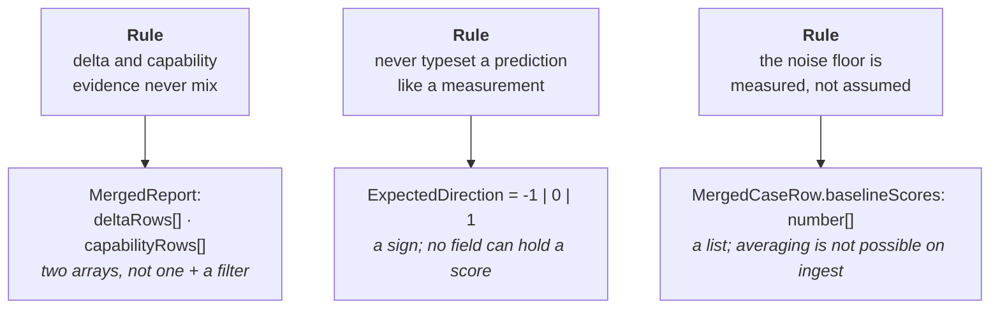

# Step 1 — data structures

Artifact: `scripts/types.mjs` — 19 JSDoc typedefs, no runtime code.
This document carries the intent; the file carries the shapes.

## Why JSDoc and not TypeScript

The suites are zero-dependency by design. JSDoc typedefs check in an editor and
under `npx tsc --noEmit --checkJs` without adding a build step or a package to
install — which matters more than usual here, because a `scaffold_script` runs under
a hard two-minute cap, before credentials exist, with no ssh keys or credential
helpers (`harness-facts.md` #1). Any suite that needs an install to work is a suite
that flakes for reasons unrelated to the skill under test.

## Three shapes that encode a rule

Reporting rules written as prose do not fail. These three are written into the type
system instead, where getting them wrong requires deliberate effort.

**`EvidenceKind` splits `delta` from `capability`.** Case 5 replays a transcript,
which carries the plugin into both arms, so it runs `--ablation none` and its score
has no referent. A 0.65 against nothing is description, not evidence. Keeping the
two in separate arrays means averaging them into one headline takes a deliberate
concatenation rather than a forgotten filter.

**`ExpectedDirection` is `-1 | 0 | 1`.** A predicted number rendered beside a
measured one gets read as a measurement, screenshotted, and quoted. The structural
fix is that no field exists which could hold one. `0` is a real expected value
rather than a default: the anti-ceremony guardrail case passes when the delta is
near zero, and a *positive* delta there is a failure.

**`baselineScores` is `number[]`.** Three sweeps each produce a stock-Claude column
against identical cases, and the spread between them is the only variance estimate
this design gets without paying for extra runs. A `number` field would throw it
away silently at ingest.

A fourth, smaller one: `PreRegistration.publishAllConditions` is typed as literal `true`.
The undertaking to publish the placebo and one-liner columns whatever they show is
not a toggle, so the type admits no other value.

## Skill-agnostic on purpose

Nothing in the file names a skill. A suite lives at `evals/<skill>/` and supplies
its own conditions, cases and pre-registration.

`ConditionId` is `'treatment' | 'oneliner' | 'placebo'` rather than naming the primer,
because a union with `'primer'` in it fails the moment a second skill gets a suite.
`Condition.controlsFor` carries the meaning instead — each control is identified by the
confound it strips, not by what it contains.

## What is borrowed rather than owned

Five typedefs describe `aggregate-result.json`, which belongs to
`claude plugin eval` and not to us. Only the subset the merger reads is declared,
and unknown fields are tolerated rather than asserted: the document is an
additive-only contract, so pinning its exact shape would break on the next CLI
release for no gain.

One borrowed field is a trap worth re-reading before step 6. **`HarnessRun.error`
being non-null does not imply a score of zero** — a timed-out or turn-capped run is
still graded on whatever it produced. An error field that does not mean "no result"
is exactly how a dead run passes an absence grader, which is the liveness hazard
the plan flags for every case in the suite.
