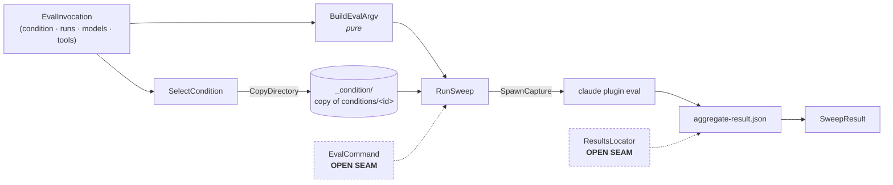
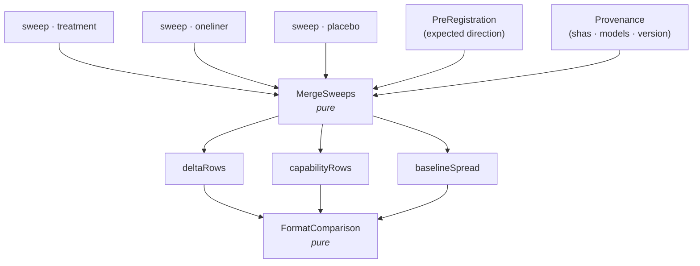

# Step 2 — interfaces

Artifact: `scripts/interfaces.mjs` — 24 `@callback` signatures, no bodies.
This document carries the intent; the file carries the contract.

## The one decision

**Everything that decides something is pure. Everything that touches the world
takes a named handle as its first parameter.**

That line is drawn where it is because of what this suite is for. It exists to
produce numbers that survive a skeptical reader, and every judgement it makes —
which flags go on the command line, which runs count toward a score, what a
contrast is worth against the noise floor — is a place where a quiet mistake
produces a *plausible number* rather than an error. Pure functions make each of
those assertable in a test that spawns nothing and touches no disk.

The corollary matters as much: the effectful functions are then thin enough to be
obviously correct by reading, because all they do is move bytes.

## One sweep, end to end

The condition is **not** a command-line flag. The harness discovers the plugin from
the path it is pointed at, so choosing a condition means putting that condition's
directory at `_condition/` before the process starts. Every case names that one
fixed path, which is what lets a single set of cases serve three conditions.

It has to be a real copy. The harness's plugin ownership check rejects a path that
"is a symlink (or can be read as a link)" (`harness-facts.md` #2), so the tidier
symlink version fails at the point of use rather than at the point of writing.

## Three sweeps into one comparison

Each sweep yields a `with` arm and — under `with-without` — its own `without` arm
of stock Claude Code against identical cases. Three sweeps therefore
produce three independent baselines, and **their spread is the noise floor,
measured for free**. `FormatComparison` prints it beside the contrasts because a
contrast smaller than the spread is not a finding.

`deltaRows` and `capabilityRows` leave `MergeSweeps` as separate arrays rather
than one list with a discriminator field, so combining them downstream takes a
deliberate concatenation instead of a forgotten filter.

`ComputeContrasts` reads expected direction from the pre-registration and never
infers it from the numbers in front of it. That is the entire value of having
registered it.

## The three open seams — all resolved in step 4

Each was an injected dependency that read as clean precisely because it deferred the
question of who supplies it. All three were answered by running, not by deciding.
Commands and observed mechanisms: `4-recon.md`.

| Seam | Resolution |
|---|---|
| `EvalCommand` | Executable from `EVAL_CLAUDE_BIN` (default `claude`); always inject `CLAUDE_CODE_WALNUT_SPIRE=1`, which is a no-op on a flag-enabled account. Never in the repo's `.claude/settings.json`. |
| `ResultsLocator` | Newest `<eval-dir>/results/<ISO-timestamp>/aggregate-result.json`. `--eval-dir` accepts a path. |
| `PreRegistrationDigest` | Content hash, plus a hard failure when `git status --porcelain` reports the file dirty. A digest a reader cannot check out is worse than none. |

A fourth seam appeared at step 3 and closed in the same recon: case 5's transcript is
**hand-written**, not recorded — two records resume correctly.

The diagrams above still show `EvalCommand` and `ResultsLocator` as dashed nodes.
That is deliberate: they remain the points where this suite touches an environment it
does not control, and the next CLI release is free to move either.

## Deliberately absent

- **No orchestrator signature.** What sequences the three sweeps is step 6's
  business; naming it now would fix an execution order this step has no evidence
  for.
- **No error type.** `RunSweep` returns a `SweepResult` with an exit code rather than
  throwing, because exit 1 means "a case scored below threshold" — a result, not a
  failure. A thrown error here would erase the distinction.
- **No streaming.** `SpawnCapture` buffers stdout to a string. The child can emit
  up to 64 MiB under `--json`; fine at this suite's size, wrong if it grows. A known
  simplification, not a seam.

## Correction to step 1

Step 2 surfaced two types step 1 missed, now added to `types.mjs`:

- **`EvalInvocation`** — everything that varies between sweeps. Without it
  `BuildEvalArgv` takes a dozen loose parameters.
- **`SweepResult`** — what a sweep yields, including the exit-code semantics above.

Corrected in place rather than logged and deferred. This changes what step 1
asserted, so gate 1 re-opens for those two additions.
