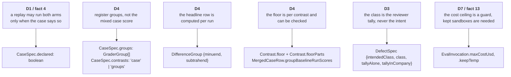

# Step 1 — data structures

Artifact: `scripts/types.mjs` — 7 JSDoc typedefs added (21 to 28) and 6 amended, no
runtime code. This document carries the intent; the file carries the shapes.

## What changed, and why each shape is the shape it is

Every addition encodes one ruling from `0-plan.md`. Where a ruling could be written as
prose or as a type, it is a type, so getting it wrong takes deliberate effort.

**`CaseSpec.declared` is a flag beside the derivation, not a replacement for it.** The
runner derives `evidence` and `ablation` from whether a case has a `history_file`, and
the reason is sound: a replayed transcript carries the plugin into both arms. That stays
the default. A case may override it by declaring both fields in its own frontmatter, and
only then may a replay case be `delta` with `with-without`. The two pairs the registration
already refuses stay refused whether declared or derived. The flag is optional so every
existing case keeps its shape unchanged.

**`CaseSpec.contrasts` is the field the merger reads before it builds a control list.**
The merger throws on any case-and-control pair with no registered direction. A case that
registers groups must not also register a direction for its mixed harness score, and the
merger must not throw for the lack of one. So the case says which score carries
contrasts: `case` (the default, and every Tier 1 case) or `groups`. Under `groups`, the
harness score is printed alone and no case-level pair is ever formed.

**Two kinds of group, one union.** A `GradersGroup` names grader names and is scored per
run the way the harness scores a case: passed weight over scored weight, with the
harness's own `withOnly` exclusion. A `DifferenceGroup` names two other groups and is the
per-run difference of their scores. The headline row of the plan is a `DifferenceGroup`,
so the "advantage on A over and above any advantage on B" is one number per run, computed
on the same run, rather than two table cells subtracted by a reader afterwards. A run
that scored no grader in a group has no group score; it is omitted, never written as
zero.

**Direction keys gain one character.** Case-level keys stay `<case>/<control>`. Group
keys are `<case>#<group>/<control>`. `#` is not allowed in a case or group name, so the
key splits without ambiguity, and the completeness check that already refuses a missing
case-level direction extends to every group of a case whose `contrasts` is `groups`.

**The floor lives on the contrast, with its parts.** Tier 1 has one floor for the
report. This suite's floor differs per group and per control, because the second
component is twice the standard error of the contrast and the control's run count
differs between `none` (three without-arm columns together) and a named condition. So
`Contrast` gains `floor` and `floorParts`: the `none` range, the error bound, the pooled
standard deviation and the two run counts. A reader can recompute the floor from the
parts; nothing about it is a bare number. `MergedCaseRow.groupBaselineRunScores` keeps
every without-arm run's group score per sweep, because the pooled standard deviation
needs runs, not means. A floor of exactly zero is not a measurement: the contrast is
withheld and the group marked unmeasurable, which is a state the report shows rather than
a number it prints.

**Three counts per condition and arm.** `runCounts`, `errorCounts` and `excludedCounts`
are registered reported figures, printed beside the group scores. The header's
`runsPerCase` is a registered lower bound and not the count that ran. A run with a
non-null `error` on a presence-graded case reads as "found nothing", so the count is on
the page. A run whose paid graders a cost ceiling skipped is excluded from group scores,
never scored zero, and the count says how many.

**`DefectSpec` records the intent and the ruling apart.** `intendedClass` is what the
designer meant. `class` is what the reviewer tally says, set mechanically. Both tallies
carry `of` beside `named`, so a tally is never read against an assumed panel size. The
in-company tally exists because the classification is taken alone and the sweep runs
against the fully seeded fixture; the two can disagree, and when they do the report says
so. `neighbour` names the defect whose observable-only probe must fail this defect's
criterion. `transcriptDigests` gives the isolation check something to check.

**`EvalInvocation` gains two optional flags.** `maxCostUsd` carries the semantics in its
comment: per invocation, a trip voids the record, so it is a runaway guard set well above
expected spend. `keepTemp` exists because a regex grader over the trace leaves no
`evidence` in the record, so a suite that grades the trace keeps the sandboxes. Both are
optional so every existing argv is unchanged.

**One borrowed field corrected.** `HarnessGraderResult.evidence` is in every real
document and was missing from the typedef. The hand-labelling of thirty judge verdicts
reads it, so it is declared, still optional, still additive.

## What was considered and left alone

- **A third `EvidenceKind`.** The scored case is a contrast with a `none` column, which
  is what `delta` means. A new kind would touch nine places in the merger and the
  invariants for no new meaning. The registration's `groups` and `contrasts` carry the
  difference instead.
- **`SuitePaths`.** Its shape is already per suite; only the runner's single instance
  was the problem, and that is a step-2 seam. Its comment now says a second suite is a
  second instance, and that `drift.json` lives under its own `resultsDir`.
- **`PreRegistration.claimCeiling`.** The Tier 1 file carries it and no script reads it.
  Typing it here would suggest the merger checks it, which it does not; I3 lives in the
  test suite and reads the plan.
- **Per-condition run counts on `EvalInvocation`.** Gate 0 chose equal counts across
  conditions, so `runs` stays one number per invocation.

## Skill-agnostic on purpose

Nothing added names a skill, a suite, a defect, or a grader. `DefectSpec` describes any
ledger entry; `GraderGroup` any grader subset; `declared` any replay case. The primer's
suite is the first to use them.

## What step 2 has to settle

The types name the shapes; they do not say who computes a group score, who reads
`declared`, or who builds the floor. Those are signatures: `extractGroupRunScores`,
`computeGroupContrasts`, `computeGroupFloor`, `readDefectLedger`,
`checkDefectAcceptance`, `checkAuthoringIsolation`, `checkTraceIsolation`,
`checkInstrumentVocabulary`, the `--suite` resolver, and `buildEvalArgv` with the two
pass-throughs. Every runtime handle among them must name who builds it.
