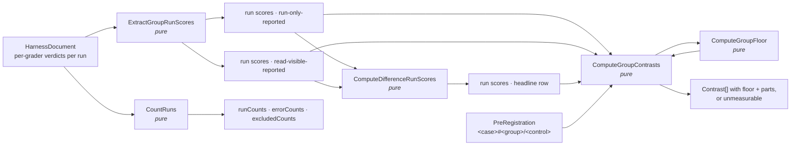
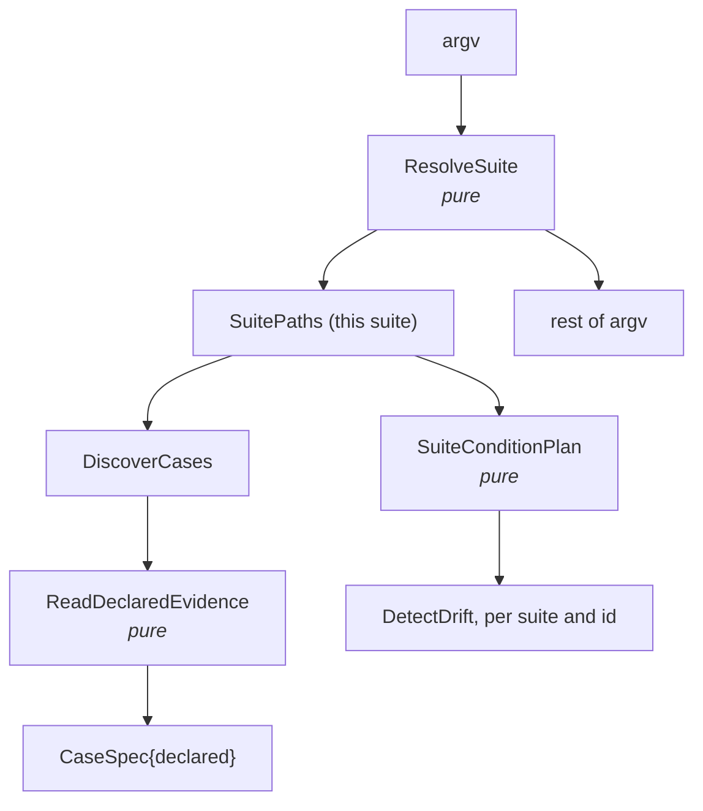

# Step 2 — interfaces

Artifact: `scripts/interfaces.mjs` — 18 `@callback` signatures added (29 to 47) and 4
amended, no bodies. This document carries the intent; the file carries the contract.

## The one decision, kept

Everything that decides something is pure. Everything that touches the world takes a
named handle as its first parameter, and the handle names who builds the real instance.
Of the eighteen new signatures, fourteen are pure. The four that touch the world are
`ReadDefectLedger` and `RunDetectScript` (built from the existing file and spawn
handles), `SuiteConditionPlan`'s consumers in the generator (the existing read and write
handles), and `AskJudge`, which is the one open seam.

## Scoring a group, end to end

Every step in the chain is a pure function over the sweep record. Nothing here needs a
new sweep, and every number a reader sees can be recomputed from the record and the
registration.

**Nulls carry meaning.** A run that scored no grader in a group, or whose paid graders
a cost ceiling skipped, is `null` in its position, never dropped and never zero. The
difference row is null wherever either side is. `CountRuns` counts the nulls. That is
how "excluded, not scored zero" becomes something the code cannot get wrong by
accident.

**The floor is built per contrast.** `ComputeGroupFloor` takes the `none` means and the
two run arrays entering one contrast and returns the floor with its parts. The multiplier
is a constant exported beside `NOISE_EPSILON`, so the function that marks a contrast and
the check that verifies the mark read the same number. A floor at or below `NOISE_EPSILON` does not become a
contrast (recon: identical runs give 2e-16, never 0); the group is returned unmeasurable,
which the formatter prints as a word.

**Direction keys are read, never inferred.** `ComputeGroupContrasts` throws on a missing
`<case>#<group>/<control>` key, as the case-level function does on `<case>/<control>`. A
case registered `contrasts: 'groups'` forms no case-level pair at all, so the throw the
plan's reviewers warned about cannot fire.

## Two suites, one runner

`ResolveSuite` replaces the runner's single module-level `paths` with an instance per
invocation. `ReadDeclaredEvidence` is the one rule change to how a case is read, stated
as a function so its refusals are testable: both fields or neither, and the two bad
pairs refused whether declared or derived. `SuiteConditionPlan` lets one generator
serve two suites, with a copied condition drift-checked against its source so the
placebo cannot quietly become two placebos.

## The ledger and the judge probe

`ReadDefectLedger` reads what the fresh-context agents wrote. `ClassifyDefect` is the
whole classification rule in four lines and nothing else sets a class.
`RunDetectScript` runs one script against one service directory and reports fired or
not. `CheckDefectAcceptance` is pure over what those runs recorded, so the acceptance
gate is a table of booleans a reader can check, not a judgement.

`JudgePrompt` is the harness's own prompt, verbatim, so the offline probe asks the judge
what a sweep would ask. `CheckCriterionProbes` requires all five verdicts and says which
must pass and which must fail.

## The open seam — resolved at step 4

| Seam | What was unknown | Resolution (`4-recon.md`, seam 4) |
|---|---|---|
| `AskJudge` | Whether the pinned CLI in print mode accepts a separate system prompt, whether its reply is one word, and what one call costs. | It does (`--system-prompt`, user prompt on stdin, `--output-format json`), it answers with one word, and a call costs about $0.075 in print mode — seventeen times the harness's own judge rate, so the probe is priced apart from the sweep. A transient "Not logged in" reply is retried once. |

Two more things are not handles but are unresolved until a run, and are listed here so
they are not mistaken for settled:

- **The trace's shape.** Settled by running: tool results appear in `trace.jsonl` as
  JSON-escaped text a regex can match, and the replayed history does not appear at all.
- **Who hands the test suite its suite list.** Settled at step 4: enumerate every
  `evals/<name>/PRE-REGISTRATION.md` and build `suitePathsFor(dir)` per hit.

## Deliberately absent

- **No orchestrator for the fresh-context agents.** Spawning the designer, the reviewers
  and the criteria author is this session's work at step 4, under supervision. It is
  not a script in this repository, because the isolation it needs (a scratch directory
  outside the checkout, a transcript kept and digested) is a property of how they are
  run, not of code that could be tested here.
- **No per-condition run count.** Gate 0 chose equal counts, so `PlanSweep` keeps one
  `runs`.
- **No signature for the reference implementation.** It is a file in the ledger, applied
  by `git apply` inside the acceptance run; the acceptance function sees only the
  boolean it produced.

## Correction to step 1

None. Every new signature is typed with the step-1 shapes or with an inline object
type small enough to live at its one use. Gate 1 does not re-open.

## Corrected at step 6

Four signatures did not survive contact with the handles they were given. Each correction
is a narrowing, and each is in the register with its reasoning.

| Signature | Declared | Built |
|---|---|---|
| `MergeSweeps` | three parameters, pure | a fourth, optional: `{traceTexts, traceFragments}`. The merger must fill `refusedCounts` from the kept traces, and a pure function cannot read them. The entry point reads them and hands them in; a merge with none publishes no fence count, and I12 refuses it. |
| `AskJudge` | the user prompt on stdin, as recon ran it | the user prompt as the trailing argument. `SpawnCapture` — the handle every spawn in this repository goes through — takes a command, arguments and an environment, and has no stdin. Recon tried the argument form too and it returned normally. |
| `RunDetectScript` | `serviceDir` as the working directory | `serviceDir` as the script's argument. `SpawnCapture` carries no working directory, and every committed script takes the service root as `$1`, defaulting to its own ledger's copy. The argument is the half that fails loudly when it is wrong. |
| `ResolveSuite` | pure, and the directory "must hold a `PRE-REGISTRATION.md`" | pure over the SHAPE; the file's existence is refused by `main`'s first read, before any spend. A pure function cannot stat a directory. Both halves of the rule hold; they are enforced in two places. |

One clause was added rather than changed. `ComputeGroupContrasts` says a floor at or below
`NOISE_EPSILON` makes the group unmeasurable; it did not say what a floor that could not be
computed at all does. It returns a contrast with no floor, which I11 refuses — "we could
not measure the noise" is not "the noise is below what this instrument resolves", and
`0-plan.md` D4 already says a missing floor refuses the merge.

